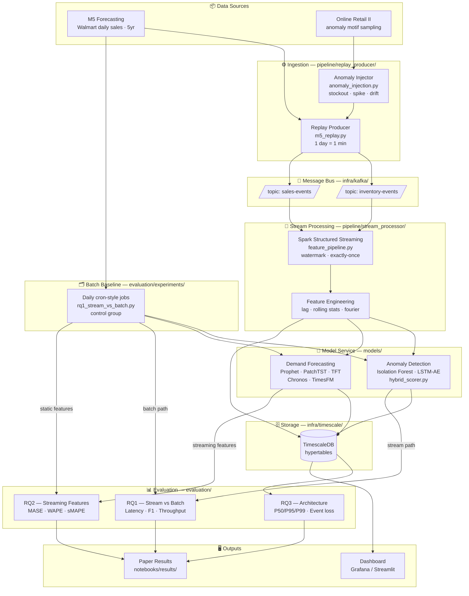

# System Architecture & Data Flow

```mermaid
flowchart TD
    subgraph SOURCES["📦 Data Sources"]
        M5["M5 Forecasting\nWalmart daily sales · 5yr"]
        ORI["Online Retail II\nanomaly motif sampling"]
    end

    subgraph INGESTION["⚙️ Ingestion — pipeline/replay_producer/"]
        AI["Anomaly Injector\nanomaly_injection.py\nstockout · spike · drift"]
        RP["Replay Producer\nm5_replay.py\n1 day = 1 min"]
    end

    subgraph KAFKA["📨 Message Bus — infra/kafka/"]
        K1[/"topic: inventory-events"/]
        K2[/"topic: sales-events"/]
    end

    subgraph STREAM["🔄 Stream Processing — pipeline/stream_processor/"]
        SP["Spark Structured Streaming\nfeature_pipeline.py\nwatermark · exactly-once"]
        FE["Feature Engineering\nlag · rolling stats · fourier"]
    end

    subgraph BATCH["🗂️ Batch Baseline — evaluation/experiments/"]
        BB["Daily cron-style jobs\nrq1_stream_vs_batch.py\ncontrol group"]
    end

    subgraph MODELS["🤖 Model Service — models/"]
        AD["Anomaly Detection\nIsolation Forest · LSTM-AE\nhybrid_scorer.py"]
        DF["Demand Forecasting\nProphet · PatchTST · TFT\nChronos · TimesFM"]
    end

    subgraph STORAGE["🗄️ Storage — infra/timescale/"]
        DB[("TimescaleDB\nhypertables")]
    end

    subgraph EVAL["📊 Evaluation — evaluation/"]
        RQ1["RQ1 — Stream vs Batch\nLatency · F1 · Throughput"]
        RQ2["RQ2 — Streaming Features\nMASE · WAPE · sMAPE"]
        RQ3["RQ3 — Architecture\nP50/P95/P99 · Event loss"]
    end

    subgraph OUT["🖥️ Outputs"]
        DASH["Dashboard\nGrafana / Streamlit"]
        PAPER["Paper Results\nnotebooks/results/"]
    end

    ORI --> AI
    AI --> RP
    M5 --> RP
    M5 --> BB

    RP --> K1
    RP --> K2
    K1 --> SP
    K2 --> SP
    SP --> FE

    FE --> AD
    FE --> DF
    BB --> AD
    BB --> DF

    FE --> DB
    AD --> DB
    DF --> DB

    AD -->|"stream path"| RQ1
    BB -->|"batch path"| RQ1
    DF -->|"streaming features"| RQ2
    BB -->|"static features"| RQ2
    DB --> RQ3

    DB --> DASH
    RQ1 --> PAPER
    RQ2 --> PAPER
    RQ3 --> PAPER
```