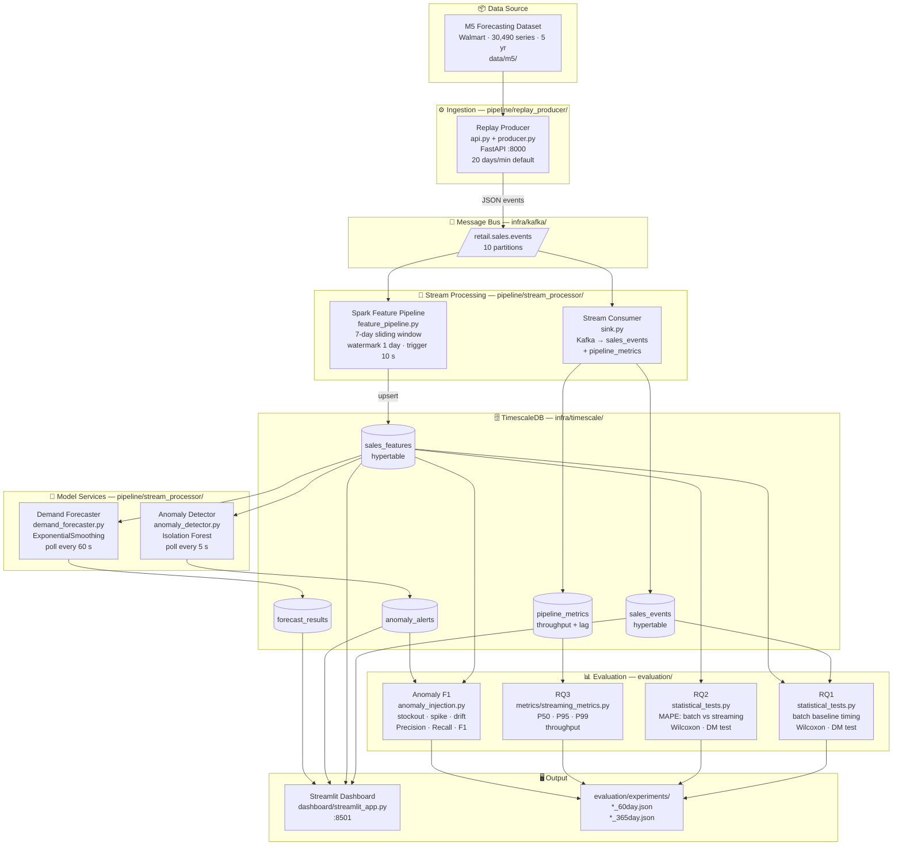

# System Architecture & Data Flow

Last updated: 2026-06-28

## Services (docker-compose)

| Container | Image / Build | Port | Role |
|---|---|---|---|
| `kafka1` | `confluentinc/cp-kafka` (KRaft) | 9092 | Message broker, single node |
| `kafka-init` | cp-kafka (one-shot) | — | Creates topics with 10 partitions |
| `timescaledb` | `timescale/timescaledb:latest-pg16` | 5432 | Primary storage (hypertables), 3 g mem |
| `spark` | `./infra/spark/Dockerfile` | 4040 (UI) | Spark master |
| `spark-streaming` | same Spark image | — | Runs `feature_pipeline.py` continuously |
| `replay-producer` | `pipeline/replay_producer/` | 8000 (FastAPI) | M5 CSV → Kafka |
| `stream-consumer` | `pipeline/stream_processor/` | — | `sink.py`: Kafka → `sales_events` + `pipeline_metrics` |
| `anomaly-detector` | `pipeline/stream_processor/` | — | `anomaly_detector.py`: polls every 5 s |
| `demand-forecaster` | `pipeline/stream_processor/` | — | `demand_forecaster.py`: polls every 60 s |
| `streamlit-dashboard` | `dashboard/` | 8501 | Live monitoring UI |

## TimescaleDB Tables

| Table | Hypertable Column | Purpose |
|---|---|---|
| `sales_events` | `time` (M5 date) | Raw Kafka events; `ingested_at` for RQ3 |
| `sales_features` | `time` | 7-day rolling features from Spark / SQL |
| `anomaly_alerts` | `detected_at` | IsolationForest output; `detection_latency_ms` for RQ1 |
| `forecast_results` | `created_at` | ESM forecasts; `feature_source` for RQ2 comparison |
| `pipeline_metrics` | `time` | Throughput + processing lag; P50/P95/P99 for RQ3 |

## Research Questions → Measurement Sources

| RQ | Summary | Measurement Source |
|---|---|---|
| RQ1 | Streaming vs batch anomaly detection latency | `statistical_tests.py` → batch baseline ms vs 5 s poll |
| RQ2 | Streaming vs batch feature forecast accuracy | `statistical_tests.py` → per-item MAPE, Wilcoxon, DM |
| RQ3 | Architecture reliability and throughput | `pipeline_metrics` → `streaming_metrics.py` |
